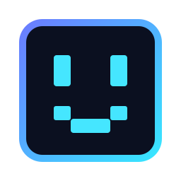

<p align="center"></p>
<h1 align="center">Shadow</h1>
<p align="center"><strong>E se sua IA pudesse trocar de cérebro sem esquecer quem ela é?</strong></p>

Shadow é um experimento open source de **identidade persistente para agentes de desktop**. O modelo pensa; Shadow mantém identidade, memória, contexto, voz, permissões e a relação com quem está usando. O Desktop Commander dá acesso ao computador — com consentimento para ações sensíveis.

Não queremos construir outro chatbot. A pergunta é mais interessante: **o que acontece quando a personalidade deixa de pertencer ao modelo e passa a pertencer ao usuário?**

## O que já funciona

- conversa por voz local com Whisper + Kokoro;
- visão da tela sob demanda;
- ações no desktop via Desktop Commander/MCP;
- memória curta e permissões lembradas;
- Google Gemini, OpenAI, Claude, DeepSeek e modelos locais pelo LM Studio;
- serviço de usuário para manter Shadow disponível em segundo plano.

```text
você → voz → Shadow → modelo escolhido
                    ↕
          memória · Observer · contexto
                    ↕
          Desktop Commander → computador
                    ↓
               voz → você
```

## Instalação

Hoje o alvo principal é Linux desktop (PipeWire/PulseAudio + systemd user). Tenha Python 3, Git, CMake, curl e Desktop Commander instalados.

```bash
git clone https://github.com/Caio-Silveira/Shadow.git
cd Shadow
./install.sh
```

O instalador prepara Whisper/Kokoro, cria os comandos locais e registra `shadow.service`. Para instalar apenas o runtime: `./install.sh --no-voice`.

Escolha o cérebro sem trocar a identidade:

```bash
shadow-provider set google      # ou openai, anthropic, deepseek, lmstudio
shadow-key set google           # não é necessário para LM Studio sem auth
systemctl --user restart shadow
```

Para LM Studio, inicie o servidor local e defina `SHADOW_LMSTUDIO_MODEL` em `~/.config/shadow/provider.env`. Veja [providers](docs/PROVIDERS.md).

## A ideia por trás

Shadow aprende, mas não deve virar um espelho que concorda com tudo. O **Observer** é uma segunda leitura interna: questiona certezas, procura pontos cegos e impede que preferências antigas virem regras eternas. Segurança pode ser determinística; personalidade precisa continuar revisável.

O prompt-base está em [`prompts/shadow.md`](prompts/shadow.md). Ele é deliberadamente simples: identidade e princípios ficam estáveis; modelo, ferramentas e contexto podem evoluir ao redor.

## Por que continuar isso?

Se amanhã você trocar Gemini por Claude, OpenAI por um modelo local, **por que deveria perder a relação construída com seu agente?** Se a memória é sua, por que ela deveria ficar presa a um fornecedor? E se o computador pudesse ter uma presença inteligente que você realmente consegue inspecionar, modificar e levar com você?

Essas perguntas ainda não têm uma resposta definitiva. Esse é o espaço do projeto.

Se alguma delas te incomodou o suficiente para imaginar uma solução melhor, abra uma issue. Se você consegue reduzir 300 ms da conversa, tornar uma permissão mais segura, melhorar memória, visão, voz ou portar Shadow para outro sistema, faça um fork e teste a ideia. **O projeto cresce por experimentos pequenos que funcionam.**

## Princípios

Privacidade local primeiro. Consentimento antes de impacto. Identidade independente do provider. Nada de fingir consciência. Nada de afirmar que uma ação aconteceu sem executá-la. Código pequeno antes de arquitetura ornamental.

MIT License — use, modifique, critique e construa em cima.
